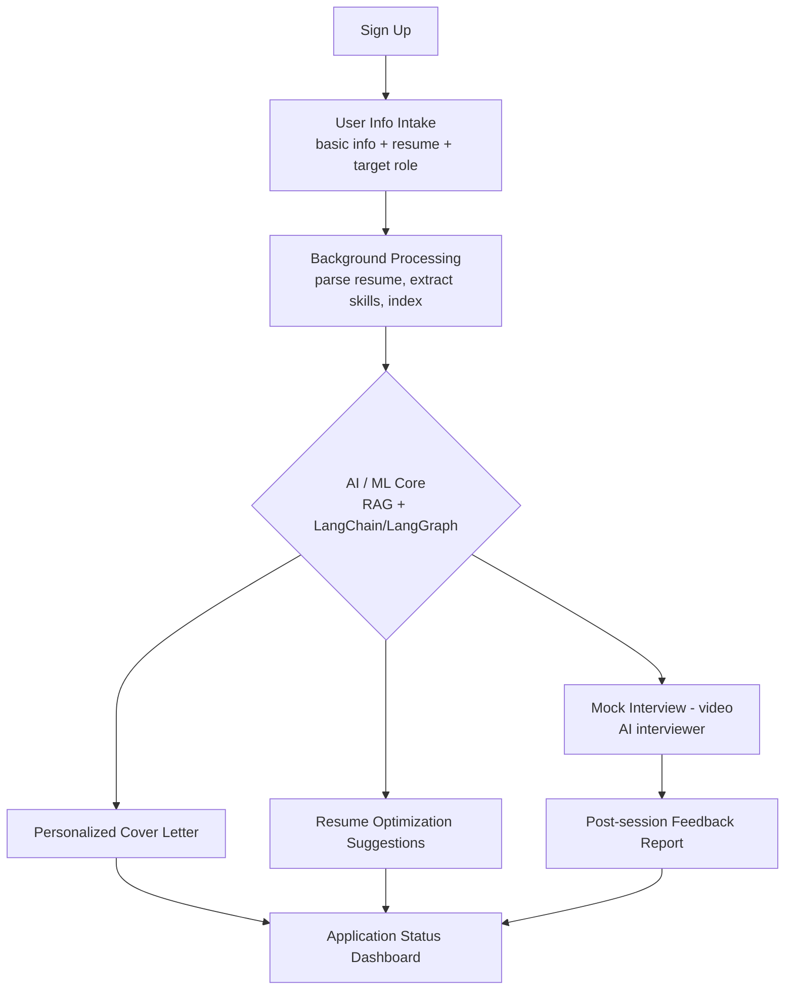
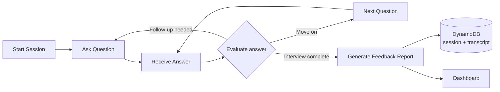
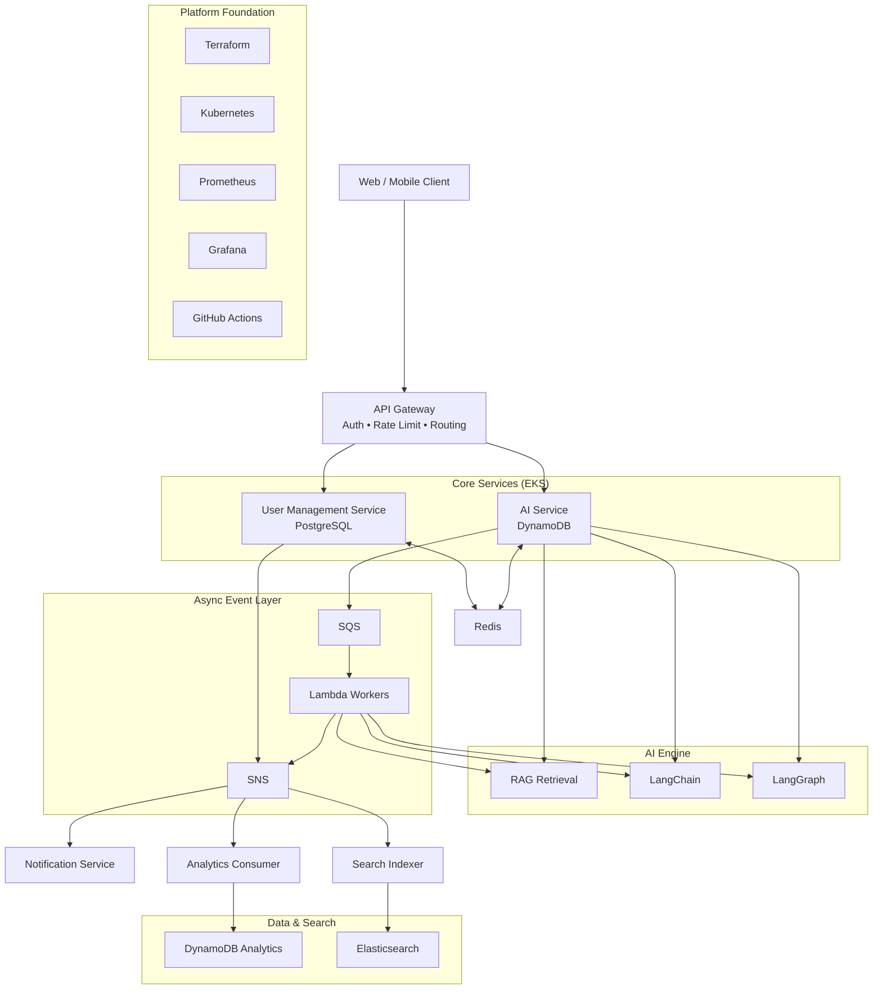
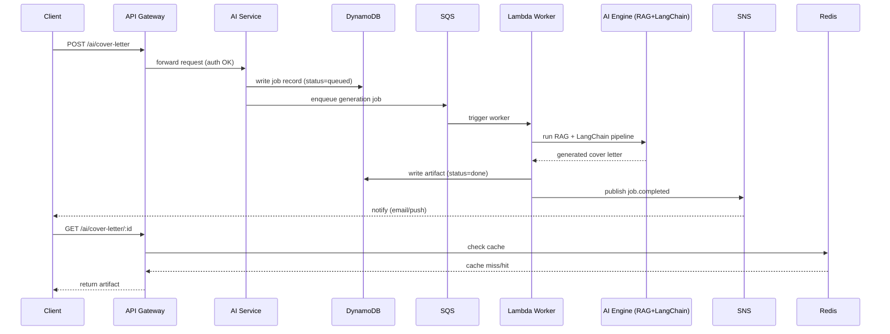

# Applica — AI-Powered Job Application Automation Platform

**Technical Architecture & System Documentation**
Version 1.0 — Draft

---

## 1. Executive Summary

Applica is a job-search automation platform that reduces the manual effort of applying to jobs. After a short onboarding flow, the system takes a user's profile and target role, and an AI layer produces tailored artifacts — optimized resumes, personalized cover letters, and application-readiness scoring — while a mock interview module lets users rehearse with an AI interviewer over video before the real thing.

The platform is built as a set of independently deployable microservices behind a single API Gateway, backed by a relational store for account data and a NoSQL store for AI/job data, an event-driven layer for background processing, and a dedicated AI engine that combines retrieval-augmented generation (RAG) with agent orchestration (LangChain / LangGraph). Infrastructure is fully codified in Terraform and runs on Kubernetes, with Prometheus/Grafana for observability and GitHub Actions for CI/CD.

**Goals**
- Automate resume tailoring and cover-letter generation per job posting
- Provide realistic, low-stakes mock interview practice with AI feedback
- Track application outcomes and surface analytics back to the user and product team
- Scale AI workloads independently from core account/business logic
- Keep infrastructure reproducible, observable, and safely deployable via CI/CD

---

## 2. Product Workflow

Step-by-step flow, mapped to the services that implement each step:

| Step | What happens | Owning component |
|---|---|---|
| Sign Up | Account creation (email/password or OAuth) | User Management Service (PostgreSQL) |
| User Info Intake | Basic profile, resume upload, target-role preferences | User Management Service + AI Service (DynamoDB) |
| Background Processing | Resume parsing, structured extraction, indexing | Lambda worker (SQS-triggered) → Elasticsearch |
| AI / ML Core | Tailoring pipeline combining profile + job description | AI Engine (RAG + LangChain/LangGraph) |
| Personalized Cover Letter | Generated, versioned per application | AI Engine → AI Service |
| Resume Optimization Suggestions | Section-by-section suggestions, not silent rewrites | AI Engine → AI Service |
| Mock Interview (video) | Real-time AI interview practice | Video/WebRTC service + LangGraph interview graph |
| Application Status Dashboard | Aggregated view of applications & AI artifacts | AI Service (DynamoDB) + Redis cache |

### 2.1 Workflow diagram

### 2.2 Mock interview sub-flow

---

## 3. High-Level Architecture

Gateway-fronted microservices pattern. Two core services own distinct data domains, an AI engine layer handles all generative workloads, and an event-driven backbone connects them without tight coupling.

### 3.1 Request path example — "Generate cover letter"

---

## 4. Core Services

### 4.1 User Management Service — PostgreSQL

Owns identity and account data. Relational storage fits here because this data is strongly structured, transactional, and benefits from joins and constraints (e.g., unique emails, foreign keys to subscription plans).

- **Responsibilities:** registration/login, session & token issuance, profile CRUD, subscription/billing state, role-based access control
- **Data model (indicative):** `users`, `profiles`, `subscriptions`, `auth_tokens`, `audit_log`
- **Interfaces:** REST/gRPC behind the API Gateway; emits domain events (`user.created`, `user.upgraded`) to SNS

### 4.2 AI Service — DynamoDB

Owns AI-generated artifacts and interview sessions. DynamoDB fits here because access patterns are key-based and high-throughput, output shape varies by pipeline, and horizontal scaling under bursty load matters more than relational integrity.

- **Responsibilities:** resume parsing results, cover-letter jobs, resume-optimization suggestions, mock-interview sessions/transcripts, job-description ingestion
- **Indicative table design:** `PK: USER#<id>`, `SK: JOB#<jobId>#ARTIFACT#<type>` — single-table design so one query returns all artifacts for an application
- **Streams:** DynamoDB Streams feed both the analytics pipeline and Elasticsearch indexing

---

## 5. API Gateway

Single ingress point for all client traffic (e.g., AWS API Gateway or Kong on Kubernetes).

- **Authentication/authorization:** validates JWTs issued by the User Management Service
- **Routing:** `/users/*` → User Management Service, `/ai/*` and `/interviews/*` → AI Service
- **Cross-cutting concerns:** rate limiting, request/response logging, payload validation, CORS
- Decouples clients from internal service topology

---

## 6. AI Engine Layer — RAG, LangChain, LangGraph

Invoked by the AI Service, not exposed directly to clients.

**RAG (Retrieval-Augmented Generation)**
Job descriptions, resume content, and a curated knowledge base (industry phrasing, interview question banks) are embedded and stored in a vector index. Relevant chunks are retrieved and injected into the prompt so outputs are grounded in the specific job and candidate.

**LangChain**
Chains prompt templates, retrieval calls, and output parsers for well-defined single pipelines: "parse resume", "generate cover letter", "score resume vs. job description".

**LangGraph**
Used where the workflow needs state and branching rather than a linear chain — the mock interview is the clearest example: it tracks conversation state turn-by-turn, decides the next question based on prior answers, and branches into a feedback-generation node once the session ends.

---

## 7. Mock Interview (Video) Subsystem

- **Session start:** AI Service creates a session record in DynamoDB (`PK: USER#<id>`, `SK: INTERVIEW#<sessionId>`), status `live`
- **Video/audio transport:** WebRTC-based service (managed or self-hosted SFU on Kubernetes) kept separate from AI reasoning so media handling scales independently
- **Turn-taking logic:** speech is transcribed, sent to the LangGraph interview graph, which returns the next question or a wrap-up signal
- **Post-session:** a feedback-generation node produces a structured report (strengths, gaps, sample stronger answers), written to DynamoDB and surfaced on the dashboard
- **Analytics hook:** session duration, question count, completion emitted as events

---

## 8. Data Analytics Pipeline

Analytics reuses DynamoDB rather than introducing a separate analytics database, keeping moving parts small at this stage.

- DynamoDB Streams capture every write to job/application/interview tables
- A stream-processing Lambda writes rollup records (DAU, applications/day, generation success/failure rate, interview completion rate)
- Elasticsearch indexes the same events for ad-hoc full-text/faceted querying
- Grafana reads from a metrics exporter on top of these tables for product-level dashboards, separate from infra dashboards

---

## 9. Asynchronous & Event-Driven Layer

**SQS — durable work queues**
Resume parsing, AI generation jobs, interview feedback generation. Visibility timeout tuned to processing time; dead-letter queues capture repeated failures.

**SNS — fan-out notifications/events**
One-to-many delivery: a single `job.completed` event fans out to notifications, analytics, and search indexing without the publisher knowing about any consumer.

**Lambda — stateless workers**
Triggered by SQS, DynamoDB Streams, or SNS; used for short, bursty tasks. Long-lived interview sessions stay on Kubernetes-hosted services instead.

---

## 10. Caching Layer — ElastiCache (Redis)

- Session cache: JWT/session lookups avoid a PostgreSQL round-trip on every request
- Hot-read cache: dashboard reads cached with short TTLs, invalidated on the relevant SNS event
- Rate-limiting counters: sliding-window counters for gateway throttling and AI-generation quota per plan tier
- Interview session state: transient turn-by-turn state lives in Redis during a live session; only the final transcript persists to DynamoDB

---

## 11. Custom Middleware & Signal/Event Bus

**Middleware chain**
Per-request pipeline (auth context, validation, logging, metrics, error normalization) applied consistently across both services.

**Signals (internal event bus)**
A lightweight in-process pub/sub (distinct from SNS/SQS, which are inter-service) for decoupling within a service — e.g., a `resume.parsed` signal that multiple internal listeners react to (cache invalidation, audit logging) without the parsing code calling each directly. Keeps the option open to promote a signal to a full SNS event later.

---

## 12. Infrastructure as Code — Terraform

- **Modules (indicative):** networking (VPC/subnets), eks-cluster, rds-postgres, dynamodb-tables, sqs-sns, api-gateway, elasticache, elasticsearch, iam
- **Environments:** dev / staging / production as separate state (or workspaces), same modules with different variable inputs
- **State:** remote state in S3 with DynamoDB-based state locking
- **Workflow:** `terraform plan` on PR (posted as a comment via GitHub Actions); `terraform apply` on merge to main, gated by manual approval for production

---

## 13. Container Orchestration — Kubernetes

- **Deployments:** one per service, each with liveness/readiness probes and resource requests/limits
- **Scaling:** HPA on CPU/custom metrics (queue depth for AI workers, active session count for interview service)
- **Namespaces:** per environment and per concern (`core-services`, `ai-engine`, `observability`)
- **Config & secrets:** ConfigMaps for non-sensitive config; secrets from AWS Secrets Manager / Sealed Secrets
- **Service mesh (optional):** mTLS/traffic policy can be layered in later (Istio/Linkerd)

---

## 14. Observability — Prometheus & Grafana

- **Prometheus:** scrapes RED metrics (rate, errors, duration) per service, Kubernetes node/pod usage, SQS queue-depth exporters
- **Grafana:** per-service dashboards plus a platform overview; alerts (DLQ depth > 0, AI error rate > threshold, Postgres connection saturation) route to on-call
- **Logs:** shipped to Elasticsearch (Fluent Bit or similar), correlated with metrics via shared request IDs from the custom middleware

---

## 15. CI/CD & Search — GitHub Actions, Elasticsearch

**GitHub Actions pipelines**
- CI: lint, unit tests, integration tests, image build, vulnerability scan — on every PR
- CD: image push to registry, `terraform plan/apply` for infra changes, rolling Kubernetes deploy on merge to main
- Build logs and test reports shipped into Elasticsearch for searchable, historical CI logs

**Elasticsearch as a product feature**
Beyond CI logs, Elasticsearch indexes parsed resume/job-description text to support fast keyword/skill search and matching across the platform.

---

## 16. Security Considerations

- All external traffic terminates at the API Gateway; internal services are not directly reachable from the internet
- JWT-based auth validated at the gateway and re-validated at each service boundary (defense in depth)
- Secrets (DB credentials, AI provider keys) stored in a secrets manager, never in Terraform state or source control
- PostgreSQL and DynamoDB encrypted at rest; TLS enforced in transit
- Least-privilege IAM roles per Lambda/service, defined and reviewed through Terraform
- Mock-interview video/audio streams and transcripts treated as sensitive user data, access scoped to the owning user only

---

## Appendix A: Technology Stack Summary

| Layer | Technology | Purpose |
|---|---|---|
| Edge | API Gateway | Single entry point; routing, auth, rate limiting, request validation |
| Core Service | User Management Service (PostgreSQL) | Accounts, auth, profile, subscription/billing state |
| Core Service | AI Service (DynamoDB) | Resume/cover-letter jobs, interview sessions, AI artifacts |
| AI Engine | RAG + LangChain + LangGraph | Retrieval-augmented generation, agent orchestration, stateful AI workflows |
| Async / Events | SQS, SNS, Lambda | Decoupled processing, fan-out notifications, serverless workers |
| Caching | ElastiCache (Redis) | Session cache, hot-read cache, rate-limit counters |
| Data & Analytics | DynamoDB (analytics tables/streams) | Event capture, usage analytics, funnel/BI queries |
| Search & Logs | Elasticsearch | Full-text search, log aggregation, CI/CD build log indexing |
| CI/CD | GitHub Actions | Build, test, security scan, deploy pipelines |
| Infra as Code | Terraform | Declarative provisioning of all AWS/K8s infrastructure |
| Orchestration | Kubernetes (EKS) | Container scheduling, scaling, service discovery |
| Observability | Prometheus + Grafana | Metrics collection and dashboards/alerting |
| Cross-cutting | Custom Middleware & Signal/Event Bus | Request middleware chain, internal pub/sub signals |

---

## 17. Suggested Next Steps

- Finalize the DynamoDB single-table design (entity keys, GSIs) before building the AI Service data layer
- Define the LangGraph state schema for the mock-interview graph early — it affects both the Redis session-state shape and the DynamoDB transcript format
- Stand up Terraform modules for networking, EKS, and data stores first, so services have a real environment to deploy into from day one
- Instrument Prometheus metrics into service code from the first deployment, rather than retrofitting later