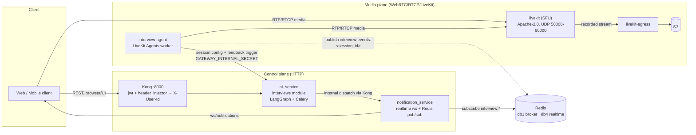
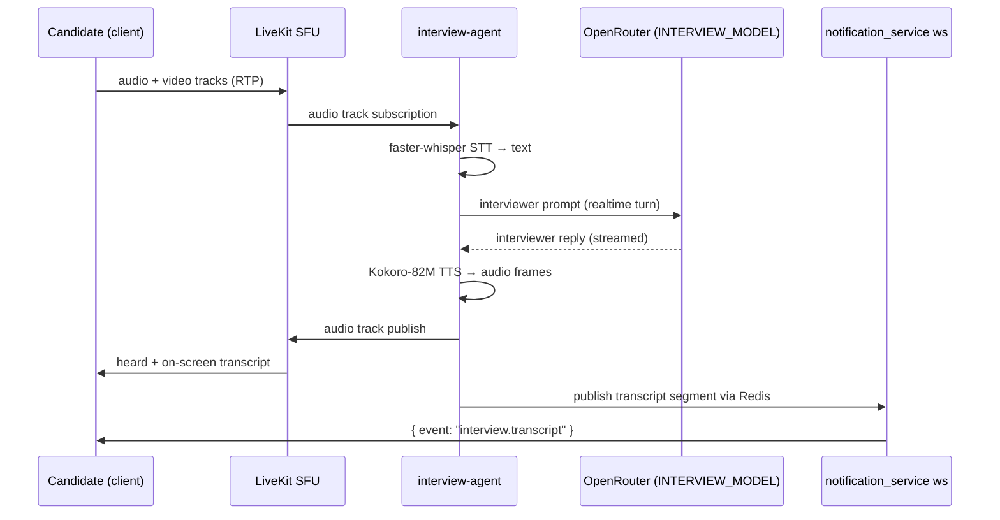

# Mock Interview System (design)

> **Status:** Accepted design — **not yet implemented**.
> Decision record: [ADR-0004](./decisions/0004-mock-interview-livekit.md).
> This document is the blueprint; the repository does not yet contain any of
> the code or services described below.

The mock interview lets a candidate rehearse a role interview against an AI
interviewer in realtime (voice + on-screen transcript), and afterwards get a
recording and a structured feedback report.

The system is split into two planes:

- **Media plane** — self-hosted **LiveKit** (WebRTC SFU) + **LiveKit Egress**
  (recording → S3) + a dedicated **`interview-agent`** worker that plays the
  AI interviewer (STT → LLM → TTS).
- **Control/intelligence plane** — a new **`interviews` module in `ai_service`**
  (session lifecycle, LiveKit tokens, LangGraph interviewer graph, Celery
  feedback task) plus a **realtime extension in `notification_service`** for
  live transcript/status push over the existing WebSocket.

---

## Requirements

- Candidate can create a mock interview for a role (optionally based on a job
  match + their master CV/evidence).
- AI interviewer conducts the interview by voice; a **live transcript** is shown
  on screen. No animated avatar (Phase 1 scope).
- Speech stack must be **free and self-hosted** with good quality:
  faster-whisper STT + OpenRouter LLM + Kokoro-82M TTS.
- Sessions get recorded (Phase 3) and stored in S3.
- On completion the candidate receives a **feedback report** (email + realtime
  event) with per-question evaluation and summary (Phase 1).
- Phased rollout: **text chat → voice → video**.

---

## Architecture overview



**Key rule:** WebRTC media goes **directly to the SFU** (UDP), never through
Kong — the gateway is HTTP-only. Kong only serves the control-plane REST API.

---

## Components

### 1. ai_service — `interviews` module (control plane)

New module under `ai_service/app/modules/interviews/` (planned path), router
registered in
[`app/api/v1/router.py`](../../ai_service/app/api/v1/router.py) under the
existing `/api/ai/v1` prefix. Reuses `GatewayAuthMiddleware` (requires
`X-Gateway-Secret`) and `X-User-Id` for ownership checks.

| File (planned) | Responsibility |
|---|---|
| `models.py` | Async SQLAlchemy models for the four tables below |
| `schemas.py` | Pydantic request/response schemas |
| `services.py` | Session creation, token issuance, lifecycle transitions |
| `graph.py` | LangGraph interviewer graph (planner → question → evaluate → next) |
| `tasks/interview_feedback_task.py` | Celery task that builds the feedback report on completion |
| `api/v1/interviews.py` | HTTP endpoints (see [API](#api-additions-planned)) |

### 2. interview-agent (media plane / AI participant)

New docker service built on **LiveKit Agents** (Python). The agent joins the
same room as a normal participant named "AI Interviewer" and runs:



- The agent loads the session's configuration (role, job/cv context, question
  plan) from `ai_service` using `GATEWAY_INTERNAL_SECRET` and the livekit token
  issued for the actor.
- Latency budget: fast text model + chunked TTS (async speech synthesis), per
  the accepted decisions.

### 3. LiveKit media plane

- **`livekit`** (Apache-2.0) — SFU. HTTP control to the API stays internal;
  media requires direct UDP reachability.
- **`livekit-egress`** — records rooms to S3 (reuses `AWS_*` /
  `S3_BUCKET_NAME` / `S3_ENDPOINT_URL`). Output metadata tracked in the
  `interview_recordings` table.
- Access tokens are LiveKit JWTs (`LIVEKIT_API_KEY` / `LIVEKIT_API_SECRET`)
  issued by `ai_service` for both the candidate and the agent actor.

### 4. notification_service — realtime extension

Mirrors the existing CV-status pattern in
[`src/modules/realtime/`](../../notification_service/src/modules/realtime/):

- Subscribe to Redis pattern **`interview:*`** (realtime Redis db 4).
- New event types in [`src/constants/eventTypes.ts`](../../notification_service/src/constants/eventTypes.ts):
  `interview.session`, `interview.transcript`.
- Push over the existing `ws/notifications` socket to the user's client.
- Feedback emails reuse the existing internal dispatch endpoint
  (`POST /api/v1/notifications/internal/dispatch`).

### 5. Kong

New routes under the existing `ai-service` profile
([`kong/services/ai-service.yml`](../../kong/services/ai-service.yml)) using the
existing `jwt` + `header_injector` plugins; the Egress-complete webhook is
authenticated by a shared signed header.

---

## Session lifecycle

State machine (`interview_sessions.status`):

```
scheduled → ready → live → completed
            └──→ cancelled
                     └──→ expired
```

| Status | Meaning | Transition trigger |
|---|---|---|
| `scheduled` | Created, not yet started | `POST /interviews` |
| `ready` | Room + token provisioned, agent idle | internal provisioning |
| `live` | Candidate/agent in room, Q&A running | room participant joined |
| `completed` | Interview finished normally | duration elapsed / user ended |
| `cancelled` | User cancelled before/during | `POST /interviews/{id}/cancel` |
| `expired` | Abandoned/inactive | inactivity timeout worker |

On `completed`, an `interview.feedback` email + realtime event is emitted and
the Celery feedback task runs.

---

## Data model (ai_service database)

Tables under `ai_service/app/modules/interviews/models/`, Alembic migration.

### interview_sessions

| Column | Type | Notes |
|---|---|---|
| `id` | uuid, PK | |
| `user_id` | uuid | owner; **no FK** across databases (plain reference) |
| `job_match_id` | uuid, nullable | optional base context |
| `status` | enum | `scheduled \| ready \| live \| completed \| cancelled \| expired` |
| `room_name` | text, unique | LiveKit room id |
| `difficulty` | enum | `junior \| mid \| senior` |
| `duration_min` | int | target session length |
| `config` | jsonb | role, job description, CV summary, question plan, eval rubric |
| `feedback` | jsonb, nullable | structured feedback report (filled by Celery task) |
| `started_at` / `ended_at` | timestamptz, nullable | |
| `created_at` / `updated_at` | timestamptz | |

### interview_questions

| Column | Type | Notes |
|---|---|---|
| `id` | uuid, PK | |
| `session_id` | uuid, FK → `interview_sessions.id` | |
| `text` | text | question |
| `category` | text, nullable | e.g. `behavioral`, `technical`, `situational` |
| `order_no` | int | sequence |
| `status` | enum | `planned \| asked \| skipped \| answered` |
| `created_at` | timestamptz | |

### interview_transcript_events

| Column | Type | Notes |
|---|---|---|
| `id` | bigint, PK | |
| `session_id` | uuid, FK | |
| `seq` | int | ordering within session |
| `ts` | timestamptz | when segment produced |
| `speaker` | enum | `candidate \| ai` |
| `segment` | jsonb | `{ text, start, end }` (SR from STT where available) |
| `created_at` | timestamptz | |

### interview_recordings

| Column | Type | Notes |
|---|---|---|
| `id` | uuid, PK | |
| `session_id` | uuid, FK | |
| `egress_id` | text, unique | LiveKit Egress id |
| `s3_url` | text | upload destination |
| `container` | text | e.g. `mp4`, `webm` |
| `status` | enum | `starting \| active \| complete \| failed` |
| `duration` | int, nullable | seconds |
| `created_at` / `updated_at` | timestamptz | |

---

## API additions (planned)

All under Kong `/api/ai/v1` (jwt + header_injector). `X-User-Id` must match the
session owner for read/mutate operations.

| Method | Path | Purpose |
|---|---|---|
| `POST` | `/api/ai/v1/interviews` | Create a session (role, optional job_match_id, difficulty, duration) |
| `POST` | `/api/ai/v1/interviews/{id}/token` | Issue a LiveKit participant JWT (ownership-checked) |
| `GET` | `/api/ai/v1/interviews` | List own sessions |
| `GET` | `/api/ai/v1/interviews/{id}` | Session detail incl. questions + feedback |
| `POST` | `/api/ai/v1/interviews/{id}/cancel` | Cancel / expire early |
| `POST` | `/api/ai/v1/interviews/webhooks/egress` | Egress-complete notification (signed webhook, internal) |

---

## Configuration

### ai_service `.env` additions

| Var | Purpose |
|---|---|
| `INTERVIEW_MODEL` | Fast OpenRouter chat model for the live interviewer |
| `LIVEKIT_URL` | SFU websocket endpoint (internal, e.g. `ws://livekit:7881`) |
| `LIVEKIT_API_KEY` / `LIVEKIT_API_SECRET` | LiveKit JWT signing keys |

### interview-agent env

| Var | Purpose |
|---|---|
| `GATEWAY_INTERNAL_SECRET` | Fetch session config from ai_service |
| `LIVEKIT_URL` / `LIVEKIT_API_KEY` / `LIVEKIT_API_SECRET` | Join rooms as actor |
| `REDIS_URL` | Publish transcript/status events (db 4) |
| `OPENROUTER_MODEL` / `OPENROUTER_API_KEY` / `OPENROUTER_BASE_URL` | Interviewer LLM |
| Whisper / Kokoro model paths | Local model artifacts |

---

## docker-compose additions

See [`docker-compose.yml`](../../docker-compose.yml).

| Service | Image | Ports (host) | Notes |
|---|---|---|---|
| `livekit` | `livekit/livekit-server` | `7881/tcp` signaling, `50000-60000/udp` media | SFU; config via env + mounted file |
| `livekit-egress` | `livekit/egress` | — | Recording → S3 |
| `interview-agent` | build (Python, agents) | — | AI interviewer worker pool |

`interview-agent` may scale horizontally (N workers × M rooms). SFU nodes scale
independently of the control plane.

---

## Scalability strategy

- **Control plane** (ai_service) is stateless — scales behind Kong; all heavy
  work (feedback, transcription summarization) is in Celery, off the request
  path.
- **SFU** scales horizontally within the same network; multi-region SFU is a
  later hardening item.
- **Agent workers** form a pool; each worker bounds its concurrent rooms.
- **Fan-out** uses one WebSocket per client with Redis pub/sub relaying, not
  one connection per producer.

---

## Phased rollout

| Phase | Scope | In scope | Validation |
|---|---|---|---|
| 0 | Scaffolding | Module + tables + Kong routes + realtime channel wiring | migrations apply; routes return auth'd; ws subscribes `interview:*` |
| 1 | **Text chat** | LangGraph interviewer graph, transcript events, feedback task + email/realtime | full loop works with **zero new infra** |
| 2 | Voice | LiveKit SFU + `interview-agent` (faster-whisper + OpenRouter + Kokoro), `/token` | realtime voice Q&A, transcript on screen |
| 3 | Video | Video tracks, Egress recording → S3, recording metadata | recording retrievable + feedback references it |
| 4 | Hardening | coturn TURN, Egress lifecycle cleanup, TLS notes, scale-out runbook | NAT-traversal coverage, cost/cleanup verified |

---

## Related docs

- [ADR-0004: Mock Interview System](./decisions/0004-mock-interview-livekit.md)
- [System overview](./system-overview.md)
- [Service map](./service-map.md)
- [ai_service](../services/ai-service/README.md)
- [notification_service](../services/notification-service/README.md)
- [Kong gateway](../infrastructure/kong/README.md)
- [Local development](../guides/local-development.md)