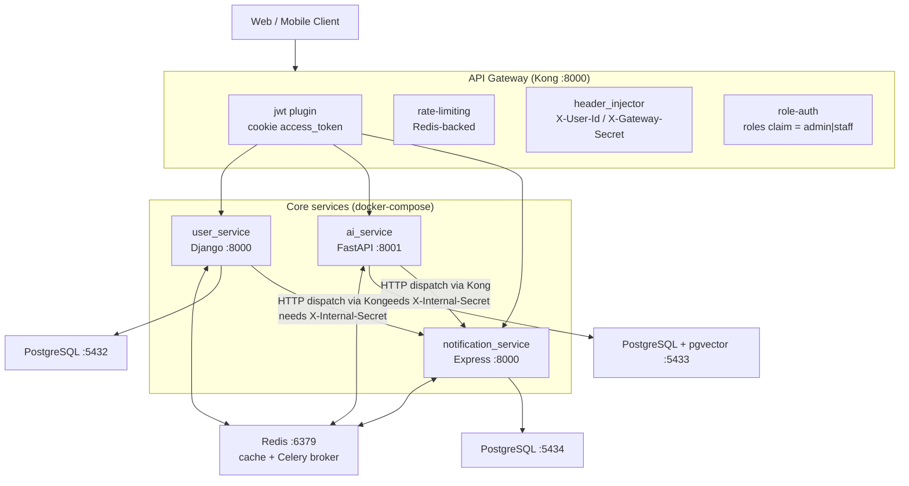
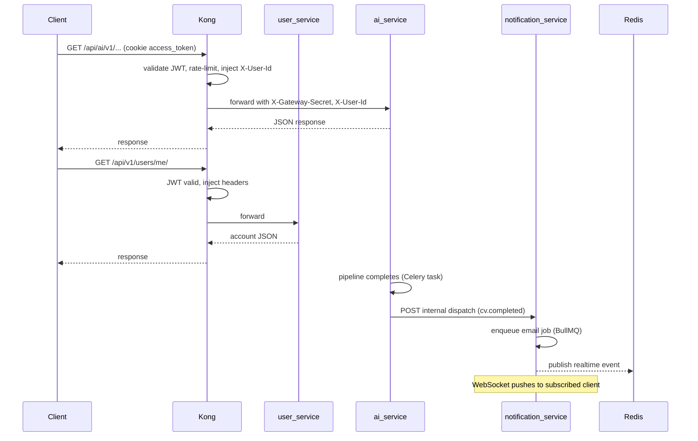

# System Overview

The Applica backend is a **gateway-fronted, three-service monorepo** that runs
locally via `docker-compose`. This document describes what actually exists in
the repository today (not the aspirational AWS design in older drafts).

## Services and data ownership

| Service | Responsibility | Stack | Database (host port) |
|---|---|---|---|
| [`user_service`](../services/user-service/README.md) | Accounts, auth (email/phone/Google), JWT cookie sessions, profiles, in-app notifications, Celery task monitoring | Django 6 + DRF + Channels | PostgreSQL `applica_db` (:5432) |
| [`ai_service`](../services/ai-service/README.md) | Master CV parse/version, job ingestion (Adzuna), pgvector RAG matching, LangGraph tailoring agents, LaTeX PDF render | FastAPI + SQLAlchemy async + Celery | PostgreSQL + pgvector `ai_service_db` (:5433) |
| [`notification_service`](../services/notification-service/README.md) | Email, SMS/OTP, realtime WebSocket push | Express 5 + TS + BullMQ + `ws` | PostgreSQL `not_service_db` (:5434, unused at runtime) |
| [`kong`](../infrastructure/kong/README.md) | Single ingress: JWT verify, rate limiting, header injection, role auth | Kong OSS, DB-less | — |

**Key rule:** each service owns its own PostgreSQL database. Cross-service
references (e.g. `ai_service.master_cvs.user_id`) are plain integers/uuids,
**never** foreign keys across databases.

## High-level flow

### Identity propagation

1. Client authenticates on `user_service`; service sets **HttpOnly** JWT
   `access_token` + `refresh_token` cookies.
2. Subsequent requests reach Kong. The bundled `jwt` plugin validates the cookie
   signature using the shared Django `SECRET_KEY` (`key_claim_name: iss`,
   issuer `applica-user-service`).
3. `header_injector` decodes the payload and adds `X-User-Id` (from `sub`) and
   `X-Gateway-Secret`. Admin routes additionally enforce `role-auth`
   (`allowed_roles: [admin, staff]`).
4. Backends trust `X-Gateway-Secret` as proof the request came through Kong:
   - `ai_service`: `GatewayAuthMiddleware` checks `X-Gateway-Secret`
     (`app/middleware/gateway_auth.py`).
   - `user_service`: admin views rely on Kong-scoped routes; internal dispatch
     requires `X-Internal-Secret`.

### Sync vs async

| Communication | Mechanism |
|---|---|
| Client → services | Sync REST (via Kong) + WebSocket (`/ws/notifications`, `ws/notifications/`) |
| `user_service` → `notification_service` | Sync HTTP dispatch `POST /api/v1/notifications/internal/dispatch` (through Kong) |
| `ai_service` → `notification_service` | Sync HTTP dispatch + AWS SNS events |
| Background work | Celery (user + ai) and BullMQ (notifications) over Redis |
| Realtime push | Redis pub/sub → WebSocket fan-out |

## Request path example — "Generate tailored CV" (through the gateway)

## Related docs

- [Service map](./service-map.md)
- [Architecture decisions](./decisions/)
- [Mock interview system (design, planned)](./mock-interview.md)
- [Kong gateway](../infrastructure/kong/README.md)
- [Local development](../guides/local-development.md)