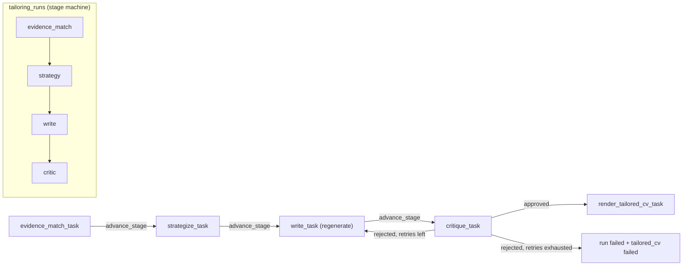
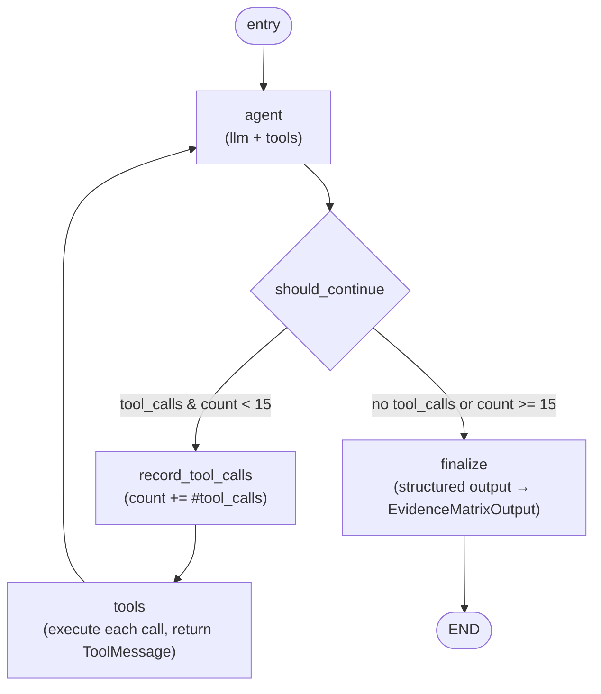
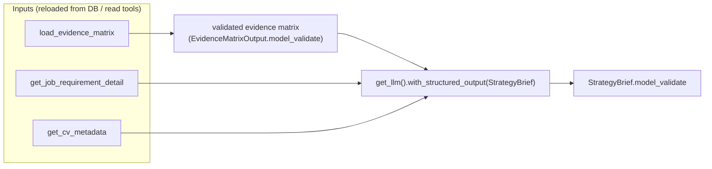
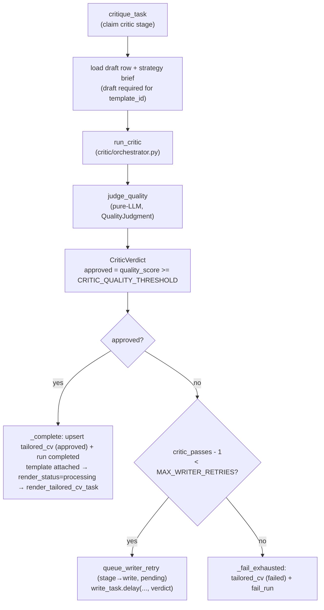

# Tailoring Agents — Workflow Architecture

The tailoring pipeline is a four-stage LangGraph/Celery pipeline that produces a
`StructuredCVDraft` + `TailoredCV` from a user's master CV and a matched job.
This document describes the workflow architecture of each agent, as implemented.

Entry: `POST /api/ai/v1/tailored-cvs/` (trigger) and `POST /api/ai/v1/tailored-cvs/{id}/render`.

## Pipeline composition

Agents run as discrete Celery stages, ordered by `STAGE_SEQUENCE` in
[`tailoring_run.py`](../../../ai_service/app/modules/tailoring/models/tailoring_run.py:40):

```
evidence_match → strategy → write → critic
```

Each run is a `tailoring_runs` row keyed on `(user_id, job_id, cv_version_id)`
(unique constraint `uq_tailoring_runs_user_job_cv`). A new `cv_version_id`
always starts a fresh run. The run machine
([`run_helpers.py`](../../../ai_service/app/modules/tailoring/helpers/run_helpers.py)):

| Transition | Helper | Condition |
|---|---|---|
| `pending` → `processing` | `try_claim_stage` | atomic claim; only if run is at this exact stage **and** status is `pending`/`failed` |
| next stage + `pending` | `advance_stage` | on success; last stage (critic) → `completed` |
| `processing` → `pending` | `release_stage_for_retry` | pre-Celery-retry, keeps same stage claimable |
| → `failed` | `fail_run` | after `max_retries` exhausted (message truncated to 2000 chars) |

Durable data is the contract between stages: each downstream stage **reloads its
inputs from the database** on retry/resume — it never trusts an upstream Celery
payload for evidence IDs/strategy content. No tool calls run in the parent Celery
process; worker-safe `NullPool` sessions (`app.db.celery_db`) are used throughout.



---

## 1. Evidence Matcher agent

Agent runs the **tool-calling loop** (not a single LLM call). Output is a
validated `EvidenceMatrixOutput` — one `EvidenceMatrixItem` per job requirement,
grounded in cited CV chunk IDs.

### Workflow graph

Compiled as `evidence_matcher_graph` in
[`agents/evidence_matcher/agent.py`](../../../ai_service/app/modules/tailoring/agents/evidence_matcher/agent.py:65).



| Node | Behaviour |
|---|---|
| `agent` | `llm_with_tools.ainvoke(state["messages"])`; appends response to `messages` |
| `record_tool_calls` | increments `tool_call_count` by the number of tool_calls on the last message; bounds the loop |
| `tools` | executes every `tool_call` via `tools_by_name`, returns `ToolMessage` per call (JSON-serialized result) |
| `finalize` | `structured_llm` (`.with_structured_output(EvidenceMatrixOutput)`) over the full message history; validates result with `EvidenceMatrixOutput.model_validate` |

`should_continue` returns `"tools"` only when the last message has `tool_calls`
**and** `tool_call_count < MAX_TOOL_CALLS` (15); otherwise `"finalize"`.

### Tools (read-only)

Registered in [`agents/evidence_matcher/tools.py`](../../../ai_service/app/modules/tailoring/agents/evidence_matcher/tools.py:223):

| Tool | Purpose | Notes |
|---|---|---|
| `search_cv_chunks(query, user_id, top_k)` | termin-overlap ranking of deterministic excerpts of `MasterCVVersion.raw_text`; `chunk_id` = `<cv_version_uuid>:<index>` | returns **nothing** when no explicit term overlap — false negative preferred over unsupported claim; `top_k` clamped `1..10` |
| `get_cv_metadata(user_id)` | current completed CV: `target_role`, `parsed_data`, extracted skills, `raw_text` | `get_current_completed_cv` |
| `get_job_requirement_detail(job_id)` | job title/description + requirements built from persisted `job_skills` | no separate requirements table |
| `get_job_match_context(user_id, job_id)` | precomputed `job_matches` rerank signal: scores, `key_matches`, `key_gaps` | lets the agent prioritize requirements needing fresh CV evidence |

### Schemas & prompting

- `AgentState` ([`schemas.py`](../../../ai_service/app/modules/tailoring/agents/evidence_matcher/schemas.py)) — `messages`, `user_id`, `job_id`, `tool_call_count`, `evidence_matrix`.
- `EvidenceMatrixItem` — `status ∈ {met, partial, not_met}` derived from confidence (`>= 0.85` met, `<= 0.15` not_met, else partial), `evidence_chunk_ids`, `excerpt`, `reasoning`.
- `SYSTEM_PROMPT` ([`prompts.py`](../../../ai_service/app/modules/tailoring/agents/evidence_matcher/prompts.py)) — enforces **ID integrity** (never guess/enumerate user/job IDs), mandates `search_cv_chunks` citation before marking `met`/`partial`, forbids inferring skills not present in retrieved chunk text, and prefers context-specific excerpts over generic skills-list mentions.

### Celery task — `evidence_match_task`

[`tasks/evidence_match_task.py`](../../../ai_service/app/modules/tailoring/tasks/evidence_match_task.py:97). `max_retries=3`, `default_retry_delay=60`.

1. **Precondition** — skips unless a `job_matches` row exists for `(user_id, job_id)` (agents only run against already-matched jobs).
2. **Prepare/claim** — `get_or_create_run` + `try_claim_stage(run, evidence_match)`.
   - Not claimable but stage is `evidence_match` → skip (already processing/completed).
   - Not claimable and stage already advanced → **resume downstream** by queueing `strategize_task` directly.
3. **Invoke agent** — seed state with `SYSTEM_PROMPT` + human message carrying exact `user_id`/`job_id`.
4. **Persist** — `save_evidence_matrix` (matrix + one `EvidenceItem` row per item; this assigns the `evidence_item_id` used downstream), then `advance_stage`.
5. **Handoff** — `strategize_task.delay(user_id, job_id, str(cv_version_id), None)`.
6. **Failure** — `release_stage_for_retry` while retries remain; `fail_run` at `max_retries`.

---

## 2. Strategist agent (CV Strategist)

Agent is **not a graph** — a single structured-output LLM call. It decides *how*
to tailor (no content writing). Inputs are reloaded/reconstructed from storage.

Implemented in
[`agents/cv_strategist/agent.py`](../../../ai_service/app/modules/tailoring/agents/cv_strategist/agent.py:19).



| Step | Detail |
|---|---|
| Evidence validation | the evidence matrix is validated as `EvidenceMatrixOutput` **before** reaching the LLM — the matcher is the source of truth for any claim the strategist may surface |
| Message build | `SystemMessage(STRATEGIST_SYSTEM_PROMPT)` + one `HumanMessage` with evidence matrix, job requirements, candidate metadata (JSON) |
| Output | `run_strategist` returns a `StrategyBrief` (validated) |

### `StrategyBrief` schema & prompting

[`schemas.py`](../../../ai_service/app/modules/tailoring/agents/cv_strategist/schemas.py:6):

- `lead_experiences` — chunk_ids from the evidence matrix to foreground, ordered by relevance.
- `gaps_to_address` — `not_met`/`partial` requirements to reframe carefully, **never** fabricate.
- `keywords_to_weave` — ATS keywords phrased as they appear in the job's own text.
- `section_order` — data-driven, reflects actual strength pattern (no fixed default).
- `tone ∈ {formal, conversational, technical, executive}` + `reasoning` (internal).

Prompt rules: only reference chunk_ids/requirements present in the evidence
matrix; `not_met` items must be omitted or reframed via a genuinely transferable
`met`/`partial` item — no invented experience.

### Celery task — `strategize_task`

[`tasks/strategize_task.py`](../../../ai_service/app/modules/tailoring/tasks/strategize_task.py:69). `max_retries=3`.

1. **Prepare/claim** — `get_or_create_run` + `try_claim_stage(run, strategy)`; loads the **committed** matrix via `load_evidence_matrix` (never the upstream Celery payload) — raises if no stored matrix.
2. **Read inputs** — `get_job_requirement_detail.ainvoke` + `get_cv_metadata.ainvoke`; raise on `found=false`.
3. **Invoke** — `run_strategist(matrix, requirements, metadata)`.
4. **Persist** — `save_strategy_brief`, then `advance_stage`.
5. **Handoff** — `write_task.delay(user_id, job_id, cv_version_id, None, None)` (writer consumes DB snapshots, incl. persisted evidence-item IDs).
6. **Failure** — same `release_stage_for_retry` / `fail_run` pattern.

---

## 3. Critic agent

Agent is a **pure-LLM reviewer** (no deterministic verification helpers). It
observes the writer's draft against the strategy, with real evidence excerpts as
grounding context, and returns a `CriticVerdict`. Its lineage: per commit
`e96cdaf` "reduced critical agent functionalities and make depend almost llm".

### Workflow



### Components

- **Orchestrator** [`critic/orchestrator.py`](../../../ai_service/app/modules/tailoring/critic/orchestrator.py:14) — `run_critic` loads all `EvidenceItem` rows for the run (requirement, status, confidence, chunk_ids, excerpt, reasoning) and passes them as grounding context to `judge_quality`; produces the `CriticVerdict` with `approved = quality_score >= settings.CRITIC_QUALITY_THRESHOLD`.
- **Quality judge** [`critic/helpers/quality_judge.py`](../../../ai_service/app/modules/tailoring/critic/helpers/quality_judge.py:58) — one structured-output call (`with_structured_output(QualityJudgment)`) over `cv_draft`, `strategy`, and optional `evidence`. The system prompt enforces: every issue must quote the exact section and request a concrete change (issues are the writer's **only** revision instruction); never demand data absent from draft+evidence; don't flag valid alternate wording; flag claims that outpace the cited evidence; flag malformed output (truncation, placeholders, stray markdown, empty required sections).

  Score anchors (system prompt): `0.90–1.00` approve · `0.80–0.89` minor fixable · `0.70–0.79` several issues · `0.50–0.69` major deviations/grounding · `<0.50` fails strategy/unsupported claims.

- **Schemas** [`critic/schemas.py`](../../../ai_service/app/modules/tailoring/critic/schemas.py) — `QualityJudgment` (`quality_score` 0..1 + `issues`), `CriticVerdict` (`approved`, `fabrication_flags`, `quality_score`, `issues`, `reasoning`). Note: current `run_critic` returns empty `fabrication_flags`; grounding is enforced through the quality score gate.

### Celery task — `critique_task`

[`tasks/critique_task.py`](../../../ai_service/app/modules/tailoring/tasks/critique_task.py:134). `max_retries=3`.

1. **Prepare/claim** — `try_claim_stage(run, critic)`; loads the full draft row (needs `cv_template_id`) + strategy brief.
2. **Critique** — `run_critic` → `persist_critic_verdict` (increments `critic_retry_count`, stores verdict on the run — every pass stays inspectable).
3. **Approved** — `upsert_tailored_cv(status=approved)`; if a template is attached, set `render_status=processing` and queue `render_tailored_cv_task`; else stays `pending` until the user triggers render with a template. Run → `completed`.
4. **Rejected, retries remain** (`critic_passes - 1 < MAX_WRITER_RETRIES`) — `queue_writer_retry` (stage back to `write`, status `pending`) and re-queue `write_task` with the verdict + prior draft so the writer can regenerate.
5. **Rejected, exhausted** — `upsert_tailored_cv(status=failed)` + `fail_run` with verdict reasoning/issues.
6. **Failure** — `release_stage_for_retry` / `fail_run` (no draft/verdict to persist).

The write↔critic loop is bounded by `MAX_WRITER_RETRIES`; the exact budget is
`critic_passes - 1 < MAX_WRITER_RETRIES`, i.e. the first pass costs one pass and
each rejection consumes one retry.

---

## Related

- [ai_service README](./README.md)
- [CV Processing](./CV_PROCESSING.md)
- [Service map](../../architecture/service-map.md)
- Models: `tailoring_runs`, `evidence_matrices`/`evidence_items`, `strategy_briefs`,
  `structured_cv_drafts`, `tailored_cvs`