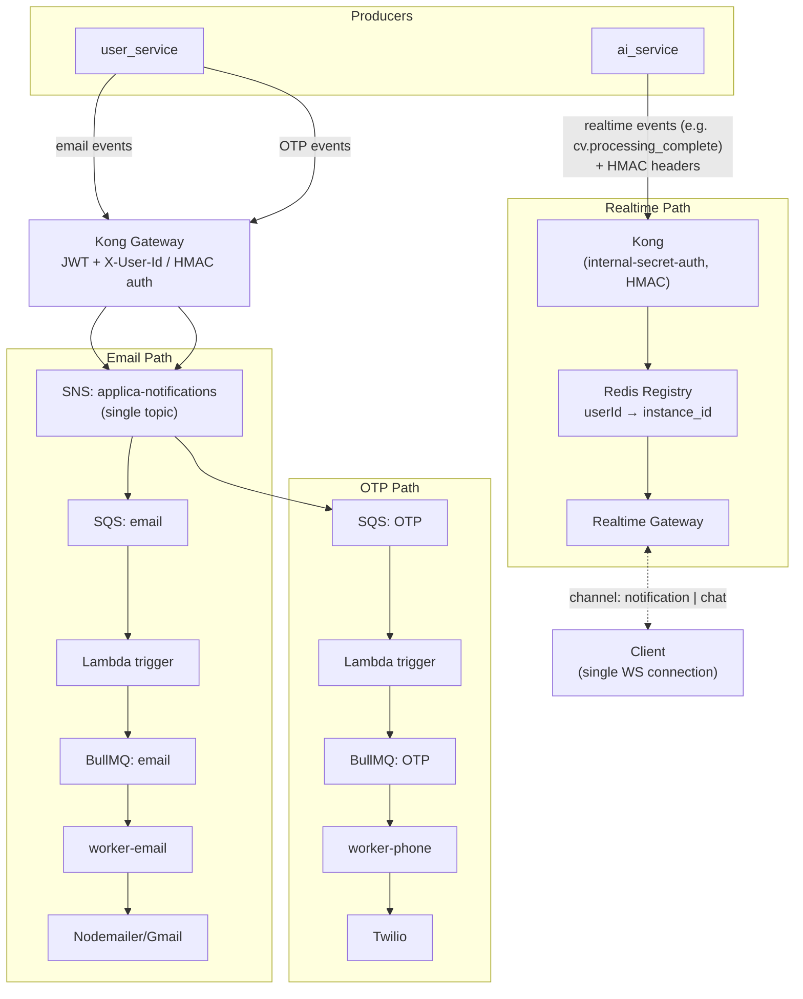
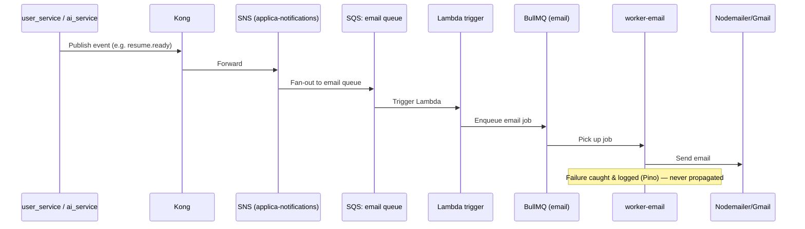
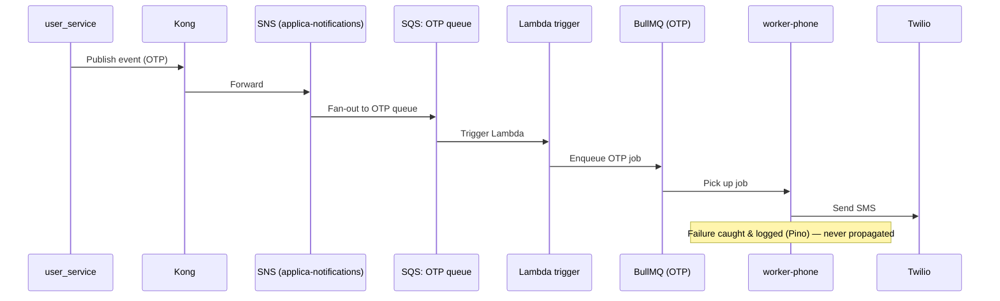
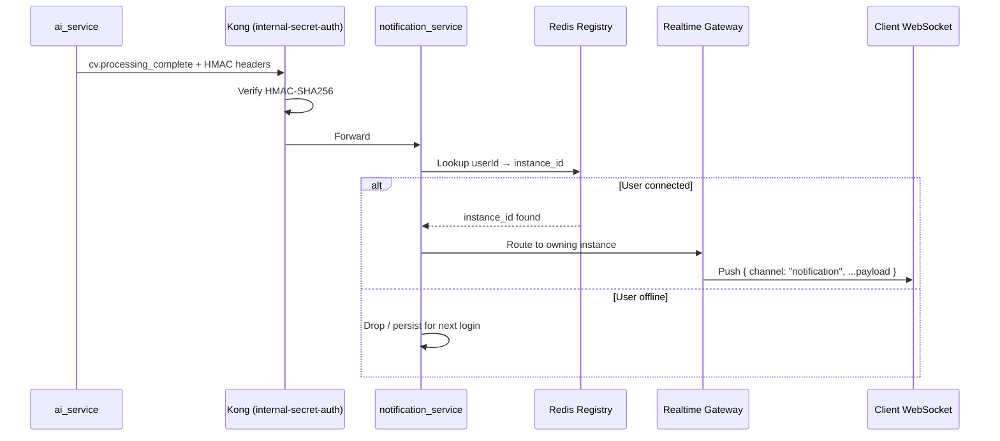
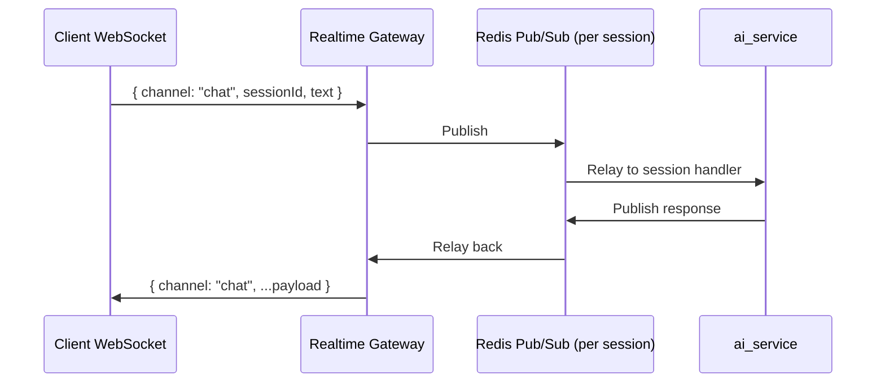

# Applica — `notification_service` Overview

## 1. What it does

`notification_service` (Node.js / Express / TypeScript) handles **all outbound notifications**:

- **Email** — account events, resume ready, job matches
- **SMS** — OTP, alerts
- **Realtime push** — WebSocket updates (CV processing, AI chat, mock interviews)

`user_service` and `ai_service` produce the events. This service only delivers them.

There are three delivery paths:

1. **Email** → SNS (`applica-notifications`) → SQS: email queue → Lambda trigger → BullMQ → worker → Nodemailer/Gmail
2. **OTP / SMS** → same SNS topic, but its own SQS: OTP queue → Lambda trigger → BullMQ → worker → Twilio
3. **Realtime push** → via Kong (`internal-secret-auth` HMAC) → Redis connection registry → WebSocket
4. **AI chat / mock interview** → per-session Redis pub/sub (separate, bypasses everything above)

---

## 2. Component Map

---

## 3. Flow 1 — Email

**Notes**
- Routing by event `type` via Zod discriminated unions.
- Email currently goes through **Nodemailer/Gmail only** — AWS SES is not in use yet.
- Uses the same **single SNS topic** (`applica-notifications`) as OTP — separated at the SQS layer, one queue per channel.

---

## 4. Flow 2 — SMS / OTP

Now follows the **same async shape as email** — just with its own dedicated SQS queue and Lambda trigger, so it's isolated from the email pipeline.

**Notes**
- No longer a direct sync HMAC call — OTP is now async, mirroring the email path.
- Publishes to the **same single SNS topic** (`applica-notifications`) as email; separated by having its own dedicated SQS queue and Lambda trigger, so the two pipelines don't share fan-out or throughput limits.

---

## 5. Flow 3 — Realtime Push (CV Processing, etc.)

**Not via SNS/SQS.** `ai_service` calls `notification_service` through **Kong**, authenticated with the same `internal-secret-auth` HMAC scheme used for internal dispatch, and the message is routed straight to the connection registry for delivery.

**Notes**
- No SNS/SQS/BullMQ in this path — it goes through Kong via the `internal-secret-auth` HMAC route, same auth mechanism as other internal dispatch, but delivery is synchronous straight to the registry (no BullMQ queue in between).
- One WebSocket per client; messages tagged `channel: "notification"` vs `"chat"`.
- Redis registry (`userId → instance_id`) lets any gateway instance find the socket owner, which is what makes the gateway shardable.

---

## 6. Flow 4 — AI Chat / Mock Interview (fully separate)

**Notes**
- Same WebSocket connection as notifications, separated only by the `channel` tag.
- Session-scoped pub/sub, not the user-scoped connection registry.
- No SNS, SQS, or BullMQ involved — kept separate for latency reasons.

---

## 7. Comparison Table

| Flow | Trigger | Transport | Queue | Worker | Terminal Action |
|---|---|---|---|---|---|
| Email | Business event | SNS → SQS → Lambda | `email` | `worker-email` | Nodemailer/Gmail send |
| SMS / OTP | Business event | SNS → SQS → Lambda | `OTP` | `worker-phone` | Twilio send |
| Realtime push | Async event (e.g. `cv.processing_complete`) | **Kong (internal-secret-auth HMAC)** | — | — (routed via registry) | WS push |
| AI chat / interview | Live session turn | Redis pub/sub (per-session) | — | Realtime Gateway | WS push, same socket |

---

## 8. Kong Recap

- **User-facing routes:** JWT + `header_injector` → injects `X-User-Id`.
- **Internal secret-bearing dispatch:** `internal-secret-auth` (HMAC-SHA256, `X-Internal-Signature` + `X-Internal-Timestamp`) — now used for the **realtime push** path (`ai_service` → Kong → `notification_service`), since OTP moved off it to the async SNS/SQS/Lambda pipeline.
- Active cleanup: `kong.yml` field-name mismatches, YAML anchor reuse, confirming plugin scope is limited to the realtime dispatch route.

---

## 9. Infra Notes

- Workers: `notification-worker-email`, `notification-worker-phone`, `notification-worker-realtime` — one per channel, for provider isolation.
- Queues: BullMQ (Redis-backed), separate per channel.
- Schema: Prisma v7 (pinned), multi-file schema under `prisma/schema/`.
- DB: PostgreSQL on port `5434`.
- Logging: Pino.
- Failure isolation: every delivery attempt is wrapped so failures are logged, never propagated to the caller.