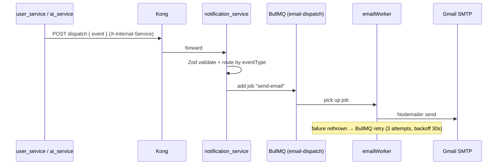
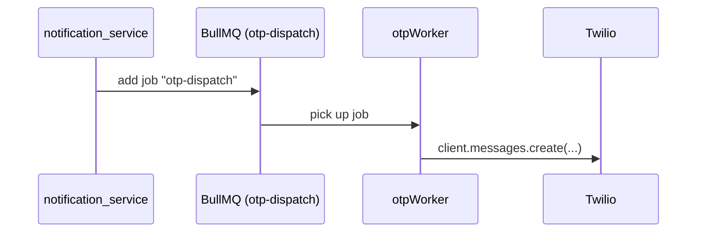
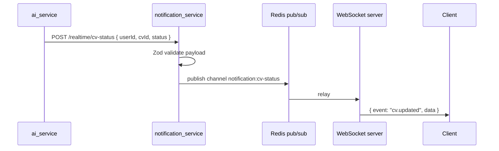

# notification_service

Node.js (Express 5 + TypeScript) service. Handles **all outbound
notifications** for the platform:

- **Email** — account events (registration, verification, password, email
  change) via Gmail SMTP (Nodemailer)
- **SMS / OTP** — phone verification and login OTPs via Twilio
- **Realtime** — WebSocket push (CV processing status) via Redis pub/sub + `ws`

Producers are `user_service` (auth events) and `ai_service` (CV pipeline
events). This service only receives events and delivers them.

> ⚠️ This doc describes the **actual implementation**. Older versions of this
> doc described an SNS → SQS → Lambda → BullMQ fan-out and Kong HMAC
> authentication — **those are not implemented**. The real path is a single
> authenticated HTTP endpoint that enqueues directly into BullMQ.

## Delivery paths (actual)

```
user_service / ai_service
        │  HTTP POST /api/v1/notifications/internal/dispatch
        ▼  (through Kong; X-Internal-Service header enforced)
notification_service (Express)
        │  Zod-validate event → switch(eventType)
        ├── email events  ──▶ BullMQ "email-dispatch"  ──▶ emailWorker ──▶ Nodemailer/Gmail
        └── otp events    ──▶ BullMQ "otp-dispatch"     ──▶ otpWorker   ──▶ Twilio

ai_service ──▶ POST /api/v1/notifications/realtime/cv-status
                  │
                  ▼
              Redis pub/sub (channel: notification:cv-status)
                  ▼
              WebSocket (ws/notifications) ──▶ client { event: "cv.updated" }
```

### Email flow



### SMS/OTP flow

Same shape as email, but its own queue + worker:



### Realtime flow



## Event routing

`src/modules/notifications/controllers/eventsController.ts` routes every event
by `eventType` (`src/constants/eventTypes.ts`):

| Event type | Channel | Template |
|---|---|---|
| `account.verification_requested` | Email | verification |
| `account.user_registered` | Email | registration complete |
| `account.email_change_requested` | Email | confirm new address |
| `account.email_changed` | Email | confirmation |
| `account.password_changed` | Email | confirmation |
| `account.forgot_password_req` | Email | reset link (uses `FRONTEND_URL`) |
| `account.password_reset_completed` | Email | confirmation |
| `account.sms_verification_otp` | SMS | Twilio |
| `account.sms_login_otp` | SMS | Twilio |

## API endpoints

| Method | Path | Purpose | Auth |
|---|---|---|---|
| `GET` | `/health` | Health check | none |
| `POST` | `/api/v1/notifications/internal/dispatch` | Main event ingestion → BullMQ | `X-Internal-Service: notification-dispatcher` (set by Kong `internal-secret-auth`) |
| `POST` | `/api/v1/notifications/realtime/cv-status` | Publish CV status → WebSocket | none (fronted by Kong) |
| `WS` | `/ws/notifications` | Client push channel | `X-User-Id` header (injected by Kong `header_injector`) |

## Queues (BullMQ)

| Queue | Jobs | Worker (concurrency 10) |
|---|---|---|
| `email-dispatch` | `send-email` | `emailWorker` |
| `otp-dispatch` | `otp-dispatch` | `otpWorker` |
| `push-dispatch` | — | **unused / dead queue** (no worker or provider yet) |

Job config: 3 attempts, exponential backoff @ 30s, `removeOnComplete: 1000`
(`src/modules/notifications/service.ts`).

## Database (Prisma)

Prisma 7 is installed with a multi-file schema (`prisma/schema/`) pointing at
the `notification_postgres` database (host port 5434) — but **only a
placeholder `Test` model exists and no `PrismaClient` is used at runtime**.
The service is effectively stateless today; queues and Redis hold all state.

## Configuration

Env vars validated by `src/config/env.ts` (see `.env` in the service dir):

| Var | Purpose |
|---|---|
| `PORT` | HTTP port (default 3002, `.env` sets 8000) |
| `NODE_ENV` | `development` / `production` |
| `DATABASE_URL` | Prisma DSN (currently unused at runtime) |
| `GMAIL_USER` / `GMAIL_APP_PASSWORD` | Nodemailer Gmail credentials |
| `REDIS_HOST` / `REDIS_PORT` | BullMQ (db 3) + realtime (db 4) |
| `TWILIO_FROM_NUMBER` / `TWILIO_ACCOUNT_SID` / `TWILIO_AUTH_TOKEN` | SMS |
| `FRONTEND_URL` | Forgot-password links |

## Running

```bash
cd notification_service
npm install
cp .env.example .env     # NOTE: .env.example is currently empty — see .env
npm run dev              # API server (ts-node-dev)
npm run start:worker     # BullMQ workers (separate process)
```

Via Docker (recommended):

```bash
docker compose up --build notification_service notification-worker
```

## Tests

**None exist.** The `tests/` directory is empty, the `test` script is a stub,
and `package.json` has no `build` script even though the Dockerfile production
stage runs `npm run build` (production image build would fail today).

## External integrations

| Integration | Direction | Where |
|---|---|---|
| Gmail SMTP (Nodemailer) | outbound | `src/providers/email/gmail.ts` |
| Twilio | outbound | `src/providers/phone/phone.ts` |
| Redis | in/out | BullMQ + pub/sub (`src/config/redis.ts`) |
| Kong | inbound auth | injects `X-Internal-Service`, `X-User-Id`, `X-Gateway-Secret` |
| PostgreSQL (Prisma) | configured only | not used at runtime |

## Docs in this service

- [Setup](./setup.md) — run it locally / via docker

## Related

- [Service map](../../architecture/service-map.md)
- [Kong routing for this service](../../infrastructure/kong/routing.md)