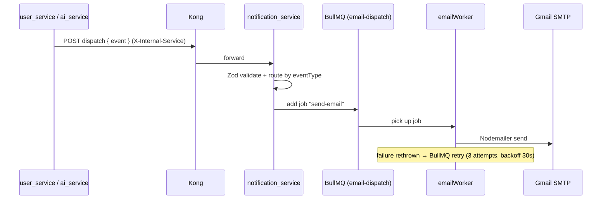
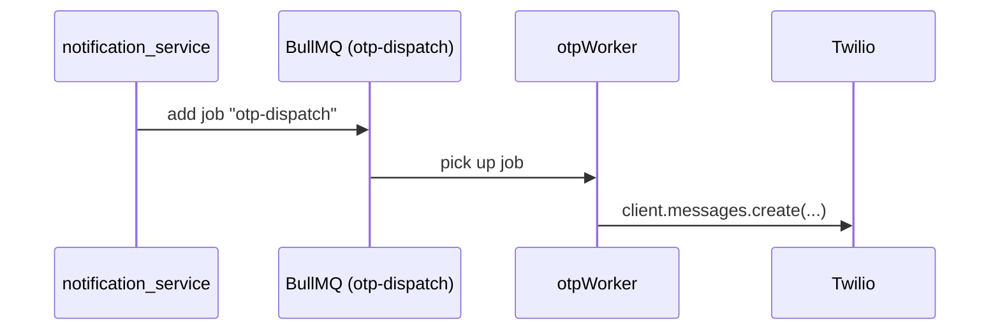
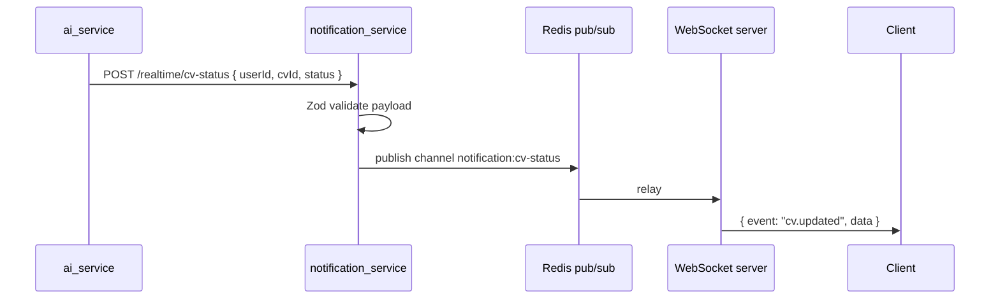

# notification_service

Node.js (Express 5 + TypeScript) service. It owns the platform's
**in-app notification inbox** and all **outbound** notifications:

- **Inbox** — the `notifications` table (Prisma/Postgres) plus the five
  `/api/v1/notify` endpoints that read and update it
- **Email** — account events (registration, verification, password, email
  change) via Gmail SMTP (Nodemailer)
- **SMS / OTP** — phone verification and login OTPs via Twilio
- **Realtime** — WebSocket push (inbox creates, CV processing status) via
  Redis pub/sub + `ws`

Producers are `user_service` (auth events) and `ai_service` (CV pipeline
events).

> ⚠️ This doc describes the **actual implementation**. Older versions of this
> doc described an SNS → SQS → Lambda → BullMQ fan-out and Kong HMAC
> authentication — **those are not implemented**. The real path is a single
> authenticated HTTP endpoint that enqueues directly into BullMQ.

## Delivery paths (actual)

```
user_service / ai_service
        │  HTTP POST /api/v1/notifications/internal/dispatch
        ▼  (through Kong; X-Internal-Service header enforced)
notification_service (Express)
        │  Zod-validate event → switch(eventType)
        ├── email events  ──▶ BullMQ "email-dispatch"  ──▶ emailWorker ──▶ Nodemailer/Gmail
        └── otp events    ──▶ BullMQ "otp-dispatch"     ──▶ otpWorker   ──▶ Twilio

ai_service ──▶ POST /api/v1/notifications/realtime/cv-status
                  │
                  ▼
              Redis pub/sub (channel: notification:cv-status)
                  ▼
              WebSocket (ws/notifications) ──▶ client { event: "cv.updated" }
```

### Email flow


```mermaid
sequenceDiagram
    participant P as user_service / ai_service
    participant K as Kong
    participant N as notification_service
    participant Q as BullMQ (email-dispatch)
    participant W as emailWorker
    participant G as Gmail SMTP

    P->>K: POST dispatch { event } (X-Internal-Service)
    K->>N: forward
    N->>N: Zod validate + route by eventType
    N->>Q: add job "send-email"
    Q->>W: pick up job
    W->>G: Nodemailer send
    Note over W: failure rethrown → BullMQ retry (3 attempts, backoff 30s)
```

### SMS/OTP flow

Same shape as email, but its own queue + worker:


```mermaid
sequenceDiagram
    participant N as notification_service
    participant Q as BullMQ (otp-dispatch)
    participant W as otpWorker
    participant T as Twilio

    N->>Q: add job "otp-dispatch"
    Q->>W: pick up job
    W->>T: client.messages.create(...)
```

### Realtime flow


```mermaid
sequenceDiagram
    participant AI as ai_service
    participant NS as notification_service
    participant R as Redis pub/sub
    participant WS as WebSocket server
    participant CL as Client

    AI->>NS: POST /realtime/cv-status { userId, cvId, status }
    NS->>NS: Zod validate payload
    NS->>R: publish channel notification:cv-status
    R->>WS: relay
    WS->>CL: { event: "cv.updated", data }
```

## Event routing

`src/modules/notifications/controllers/eventsController.ts` routes every event
by `eventType` (`src/constants/eventTypes.ts`):

| Event type | Channel | Template |
|---|---|---|
| `account.verification_requested` | Email | verification |
| `account.user_registered` | Email | registration complete |
| `account.email_change_requested` | Email | confirm new address |
| `account.email_changed` | Email | confirmation |
| `account.password_changed` | Email | confirmation |
| `account.forgot_password_req` | Email | reset link (uses `FRONTEND_URL`) |
| `account.password_reset_completed` | Email | confirmation |
| `account.sms_verification_otp` | SMS | Twilio |
| `account.sms_login_otp` | SMS | Twilio |

## API endpoints

### In-app inbox (browser-facing, `/api/v1/notify`)

The service **owns the `notifications` table** (see [Database](#database-prisma)).
These five endpoints are the whole read/write surface of the inbox; user_service
only creates rows and no longer serves any of them.

| Method | Path | Purpose | Auth |
|---|---|---|---|
| `GET` | `/api/v1/notify/` | List, newest first. `?unread_only=true&type=account.*&page=&page_size=` (1–100, default 20) | JWT + `X-User-Id` (Kong) |
| `GET` | `/api/v1/notify/unread-count/` | `{"unread": 4}` | JWT + `X-User-Id` (Kong) |
| `POST` | `/api/v1/notify/<uuid>/read/` | Mark one read, returns it. Idempotent | JWT + `X-User-Id` (Kong) |
| `POST` | `/api/v1/notify/read-all/` | `{"updated": n}` | JWT + `X-User-Id` (Kong) |
| `DELETE` | `/api/v1/notify/<uuid>/` | `204`, no body | JWT + `X-User-Id` (Kong) |

List responses use the DRF-style envelope `{count, next, previous, results}`.
A row is serialized as `{id, type, title, body, metadata, read_at, created_at}`
(snake_case, matching the API this replaced in Django).

Notes:

- `type` is either an exact value or a **trailing** wildcard (`account.*`). A
  `*` anywhere else is a `400`, because it could only ever match literally and
  would silently hide a client bug. The prefix is unconstrained, so a new
  namespace (`job.*`) works without a code change.
- A page past the end is an empty page with a `previous` link (clamped to the
  last real page), not a `404`. Only a *malformed* page is a `400`.
- Another user's row answers `404`, not `403`, so the id space can't be probed.
- The browser routes are mounted on their own `/api/v1/notify` prefix, separate
  from the internal `/api/v1/notifications/*` routes, so adding an internal path
  can never widen the user-authenticated surface.

### Outbound + service-to-service

| Method | Path | Purpose | Auth |
|---|---|---|---|
| `GET` | `/health` | Health check | none |
| `POST` | `/api/v1/notifications/internal/notifications` | Create a row (the write path for user_service) | `X-Internal-Secret` |
| `GET` | `/api/v1/notifications/internal/users/<user_id>/unread-count/` | Unread count for the `ai_service` home BFF | `X-Internal-Secret` |
| `POST` | `/api/v1/notifications/internal/dispatch` | Main event ingestion → BullMQ | `X-Internal-Secret` |
| `POST` | `/api/v1/notifications/realtime/cv-status` | Publish CV status → WebSocket | `X-Internal-Secret` |
| `WS` | `/ws/notifications` | Client push channel | JWT + `X-User-Id` (Kong) |

Every internal route is behind `requireInternalService`, which checks the shared
secret in constant time. The internal unread-count takes the user id as a path
parameter rather than trusting an `X-User-Id` header, because the caller is a
service acting on someone else's behalf.

## Queues (BullMQ)

| Queue | Jobs | Worker (concurrency 10) |
|---|---|---|
| `email-dispatch` | `send-email` | `emailWorker` |
| `otp-dispatch` | `otp-dispatch` | `otpWorker` |
| `push-dispatch` | — | **unused / dead queue** (no worker or provider yet) |

Job config: 3 attempts, exponential backoff @ 30s, `removeOnComplete: 1000`
(`src/modules/notifications/service.ts`).

## Database (Prisma)

Prisma 7, multi-file schema under `prisma/schema/`, pointing at the
`notification_postgres` database (host port 5434). The `Notification` model
(`prisma/schema/models/notification.prisma`) is the **in-app inbox** and is the
only runtime table; it was migrated from `user_service`'s Django `notifications`
table on 2026-09-29 and is the sole owner.

| Column | Type | Notes |
|---|---|---|
| `id` | `uuid` | client-referenced, avoids enumeration |
| `userId` | `bigint` | no FK — this is a separate database, so account deletion is not cascaded here |
| `type` | `varchar(64)` | dot-namespaced, e.g. `account.password_changed` |
| `title` / `body` | `varchar(255)` / `text` | |
| `metadata` | `jsonb` | PII is masked by the producer before it lands here |
| `readAt` | `timestamptz(6)?` | null = unread |
| `createdAt` | `timestamptz(6)` | |

Indexes: `idx_user_read_created (user_id, read_at, created_at DESC)` covers the
unread filter *and* the newest-first ordering, and `idx_notification_type (type)`
covers the type filter. A placeholder `Test` model also exists in the schema.

The `userId` bigint is why the repository converts to `BigInt` before querying —
Passing a JS `number` past `Number.MAX_SAFE_INTEGER` would silently lose
precision.

## Configuration

Env vars validated by `src/config/env.ts` (see `.env` in the service dir):

| Var | Purpose |
|---|---|
| `PORT` | HTTP port (default 3002, `.env` sets 8000) |
| `NODE_ENV` | `development` / `production` |
| `DATABASE_URL` | Prisma DSN for the inbox table |
| `GATEWAY_INTERNAL_SECRET` | Shared secret for internal routes and `X-Gateway-Secret` checks |
| `USER_SERVICE_URL` | Upstream used by the dispatch workers |
| `USER_SERVICE_TIMEOUT` | Timeout for those calls |
| `GMAIL_USER` / `GMAIL_APP_PASSWORD` | Nodemailer Gmail credentials |
| `REDIS_HOST` / `REDIS_PORT` | BullMQ (db 3) + realtime (db 4) |
| `TWILIO_FROM_NUMBER` / `TWILIO_ACCOUNT_SID` / `TWILIO_AUTH_TOKEN` | SMS |
| `FRONTEND_URL` | Forgot-password links |

## Running

```bash
cd notification_service
npm install
cp .env.example .env     # NOTE: .env.example is currently empty — see .env
npm run dev              # API server (ts-node-dev)
npm run start:worker     # BullMQ workers (separate process)
```

Via Docker (recommended):

```bash
docker compose up --build notification_service notification-worker
```

## Tests

`npm test` runs Vitest. `tests/inbox.test.ts` (43 cases) covers the five
`/api/v1/notify` endpoints, the internal write and unread-count routes, auth
rejection, and the isolation of one user's rows from another's.

They run against the **real Prisma client and the dev database** rather than a
mocked repository, because most of what can break here is SQL: the composite
index behind the unread filter and newest-first ordering, the `userId` bigint
coercion, and the type-prefix match. Rows are written under a synthetic user id
and deleted afterwards, so the dev inbox is left as it was found.

## External integrations

| Integration | Direction | Where |
|---|---|---|
| Gmail SMTP (Nodemailer) | outbound | `src/providers/email/gmail.ts` |
| Twilio | outbound | `src/providers/phone/phone.ts` |
| Redis | in/out | BullMQ + pub/sub (`src/config/redis.ts`) |
| Kong | inbound auth | injects `X-Internal-Service`, `X-User-Id`, `X-Gateway-Secret` |
| PostgreSQL (Prisma) | configured only | not used at runtime |

## Docs in this service

- [Setup](./setup.md) — run it locally / via docker

## Related

- [Service map](../../architecture/service-map.md)
- [Kong routing for this service](../../infrastructure/kong/routing.md)