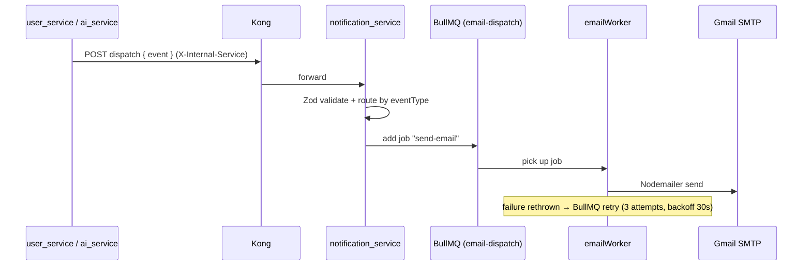
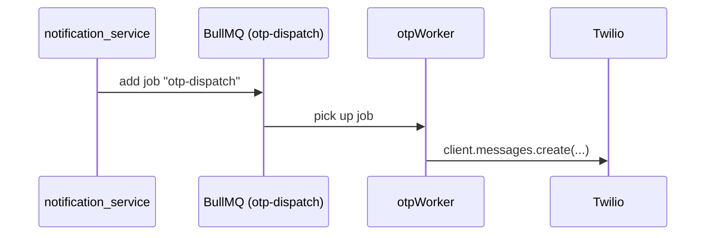
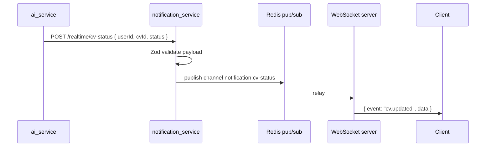
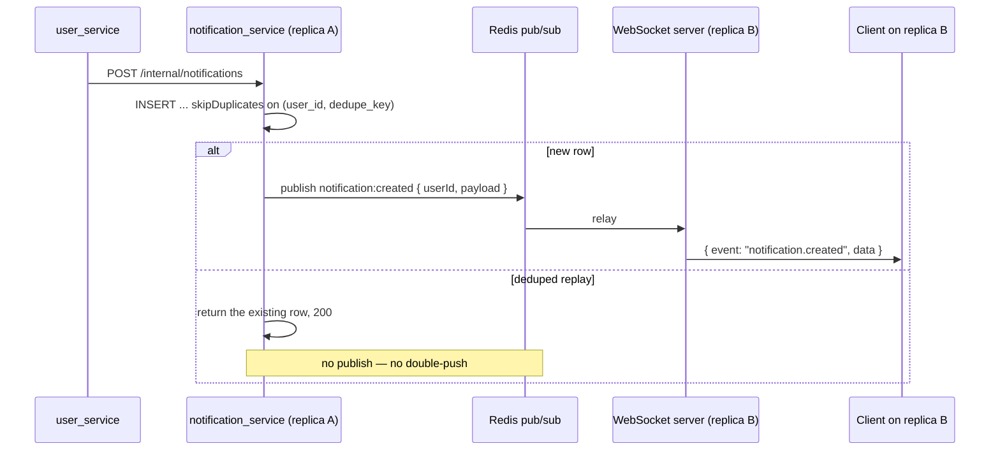

# notification_service

Node.js (Express 5 + TypeScript) service. It owns the platform's
**in-app notification inbox** and all **outbound** notifications:

- **Inbox** — the `notifications` table (Prisma/Postgres) plus the five
  `/api/v1/notify` endpoints that read and update it
- **Email** — account events (registration, verification, password, email
  change) via Gmail SMTP (Nodemailer)
- **SMS / OTP** — phone verification and login OTPs via Twilio
- **Realtime** — WebSocket push (inbox creates, CV processing status) via
  Redis pub/sub + `ws`

Producers are `user_service` (auth events) and `ai_service` (CV pipeline
events).

> ⚠️ This doc describes the **actual implementation**. Older versions of this
> doc described an SNS → SQS → Lambda → BullMQ fan-out and Kong HMAC
> authentication — **those are not implemented**. The real path is a single
> authenticated HTTP endpoint that enqueues directly into BullMQ.

## Delivery paths (actual)

```
user_service / ai_service
        │  HTTP POST /api/v1/notifications/internal/dispatch
        ▼  (through Kong; X-Internal-Service header enforced)
notification_service (Express)
        │  Zod-validate event → switch(eventType)
        ├── email events  ──▶ BullMQ "email-dispatch"  ──▶ emailWorker ──▶ Nodemailer/Gmail
        └── otp events    ──▶ BullMQ "otp-dispatch"     ──▶ otpWorker   ──▶ Twilio

ai_service ──▶ POST /api/v1/notifications/realtime/cv-status
                  │
                  ▼
              Redis pub/sub (channel: notification:cv-status)
                  ▼
              WebSocket (ws/notifications) ──▶ client { event: "cv.updated" }
```

### Email flow


```mermaid
sequenceDiagram
    participant P as user_service / ai_service
    participant K as Kong
    participant N as notification_service
    participant Q as BullMQ (email-dispatch)
    participant W as emailWorker
    participant G as Gmail SMTP

    P->>K: POST dispatch { event } (X-Internal-Service)
    K->>N: forward
    N->>N: Zod validate + route by eventType
    N->>Q: add job "send-email"
    Q->>W: pick up job
    W->>G: Nodemailer send
    Note over W: failure rethrown → BullMQ retry (3 attempts, backoff 30s)
```

### SMS/OTP flow

Same shape as email, but its own queue + worker:


```mermaid
sequenceDiagram
    participant N as notification_service
    participant Q as BullMQ (otp-dispatch)
    participant W as otpWorker
    participant T as Twilio

    N->>Q: add job "otp-dispatch"
    Q->>W: pick up job
    W->>T: client.messages.create(...)
```

### Realtime flow

Two events share one Redis pub/sub connection pair (`src/config/redis.ts`,
db 4) and one WebSocket registry, so a client connected to **any** replica
receives both:

| Channel | Event pushed | Source |
|---|---|---|
| `notification:cv-status` | `cv.updated` | `ai_service` → `POST /realtime/cv-status` |
| `notification:created` | `notification.created` | the internal create endpoint, on a genuinely new row |


```mermaid
sequenceDiagram
    participant AI as ai_service
    participant NS as notification_service
    participant R as Redis pub/sub
    participant WS as WebSocket server
    participant CL as Client

    AI->>NS: POST /realtime/cv-status { userId, cvId, status }
    NS->>NS: Zod validate payload
    NS->>R: publish channel notification:cv-status
    R->>WS: relay
    WS->>CL: { event: "cv.updated", data }
```

Inbox creation fans out the same way:


```mermaid
sequenceDiagram
    participant US as user_service
    participant NS as notification_service (replica A)
    participant R as Redis pub/sub
    participant WS as WebSocket server (replica B)
    participant CL as Client on replica B

    US->>NS: POST /internal/notifications
    NS->>NS: INSERT ... skipDuplicates on (user_id, dedupe_key)
    alt new row
        NS->>R: publish notification:created { userId, payload }
        R->>WS: relay
        WS->>CL: { event: "notification.created", data }
    else deduped replay
        NS->>NS: return the existing row, 200
        Note over NS,R: no publish — no double-push
    end
```

This indirection is what makes the feature correct under more than one replica.
Emitting straight to the local `WebSocket` server would deliver to every client
attached to *this* process and silently miss the ones attached to the others.

## Event routing

`src/modules/notifications/controllers/eventsController.ts` routes every event
by `eventType` (`src/constants/eventTypes.ts`):

| Event type | Channel | Template |
|---|---|---|
| `account.verification_requested` | Email | verification |
| `account.user_registered` | Email | registration complete |
| `account.email_change_requested` | Email | confirm new address |
| `account.email_changed` | Email | confirmation |
| `account.password_changed` | Email | confirmation |
| `account.forgot_password_req` | Email | reset link (uses `FRONTEND_URL`) |
| `account.password_reset_completed` | Email | confirmation |
| `account.sms_verification_otp` | SMS | Twilio |
| `account.sms_login_otp` | SMS | Twilio |

## API endpoints

### In-app inbox (browser-facing, `/api/v1/notify`)

The service **owns the `notifications` table** (see [Database](#database-prisma)).
These five endpoints are the whole read/write surface of the inbox; user_service
only creates rows and no longer serves any of them.

| Method | Path | Purpose | Auth |
|---|---|---|---|
| `GET` | `/api/v1/notify/` | List, newest first. `?unread_only=true&type=account.*&archived=true&page=&page_size=` (1–100, default 20) | JWT + `X-User-Id` (Kong) |
| `GET` | `/api/v1/notify/unread-count/` | `{"unread": 4}` | JWT + `X-User-Id` (Kong) |
| `POST` | `/api/v1/notify/<uuid>/read/` | Mark one read, returns it. Idempotent | JWT + `X-User-Id` (Kong) |
| `POST` | `/api/v1/notify/read-all/` | `{"updated": n}` | JWT + `X-User-Id` (Kong) |
| `POST` | `/api/v1/notify/<uuid>/archive/` | Dismiss from inbox, returns it. Idempotent | JWT + `X-User-Id` (Kong) |
| `DELETE` | `/api/v1/notify/<uuid>/` | `204`, no body | JWT + `X-User-Id` (Kong) |

List responses use the DRF-style envelope `{count, next, previous, results}`.
A row is serialized as
`{id, type, title, body, metadata, read_at, archived_at, created_at}`
(snake_case, matching the API this replaced in Django).

Notes:

- `type` is either an exact value or a **trailing** wildcard (`account.*`). A
  `*` anywhere else is a `400`, because it could only ever match literally and
  would silently hide a client bug. The prefix is unconstrained, so a new
  namespace (`job.*`) works without a code change.
- A page past the end is an empty page with a `previous` link (clamped to the
  last real page), not a `404`. Only a *malformed* page is a `400`.
- Another user's row answers `404`, not `403`, so the id space can't be probed.
- The browser routes are mounted on their own `/api/v1/notify` prefix, separate
  from the internal `/api/v1/notifications/*` routes, so adding an internal path
  can never widen the user-authenticated surface.

#### Inbox lifecycle

A notification is **live**, **archived**, or **gone**:

| State | Meaning |
|---|---|
| live (`archived_at IS NULL`) | In the default inbox. `read_at` independently says whether it has been seen |
| archived (`archived_at` set) | Dismissed by the user. Out of the inbox, out of the unread count, still listed under `?archived=true` |
| gone | Deleted by a single-row delete, by retention, or by account deletion |

Archive is deliberately **not** the same as read. "Seen" and "no longer in my
inbox" are different intents, so dismissing never has to overwrite when it was
read, and `read-all` skips archived rows rather than silently resurrecting them
into the unread count.

Retention prunes on `read_at IS NOT NULL OR archived_at IS NOT NULL`: either
endpoint means the user has dealt with the row. Unread, unarchived rows are kept
indefinitely. See [Queues](#queues-bullmq).

#### Idempotent creation

`POST /api/v1/notifications/internal/notifications` accepts an optional
`dedupeKey`. When present, `UNIQUE (user_id, dedupe_key)` makes a replay a
no-op instead of a second inbox row, and the endpoint answers `200` rather than
`201`. The same `id` comes back either way, so a client that retries cannot tell
the difference and cannot show the user a duplicate.

Producers derive the key from the domain object that caused the notification,
not from the notification itself — `"{event}:{token_id}"` for a verification
event, `"{event}:{user_id}"` for welcome. That way a *replay of the same attempt*
collapses while a *legitimate repeat* (a resend mints a new token, hence a new
key) still delivers. `dedupe_key` is nullable and btree treats NULLs as distinct,
so producers that have nothing stable to key on simply omit it.

Two failure modes converge here: an HTTP client retrying after a timeout that
followed a committed insert, and a BullMQ job re-running. Without the constraint
both surface to the user as a duplicate row.

Realtime delivery follows the same rule — a deduplicated insert does **not**
re-publish, so a retry cannot double-push.

### Outbound + service-to-service

| Method | Path | Purpose | Auth |
|---|---|---|---|
| `GET` | `/health` | Health check | none |
| `POST` | `/api/v1/notifications/internal/notifications` | Create a row (the write path for user_service). Optional `dedupeKey`; `201` new / `200` deduplicated | `X-Internal-Secret` |
| `GET` | `/api/v1/notifications/internal/users/<user_id>/unread-count/` | Unread count for the `ai_service` home BFF | `X-Internal-Secret` |
| `DELETE` | `/api/v1/notifications/internal/users/<user_id>/notifications` | Hard-delete every row for a user (account deletion). `{"deleted": n}`, idempotent | `X-Internal-Secret` |
| `POST` | `/api/v1/notifications/internal/dispatch` | Main event ingestion → BullMQ | `X-Internal-Secret` |
| `POST` | `/api/v1/notifications/realtime/cv-status` | Publish CV status → WebSocket | `X-Internal-Secret` |
| `WS` | `/ws/notifications` | Client push channel | JWT + `X-User-Id` (Kong) |

Every internal route is behind `requireInternalService`, which checks the shared
secret in constant time. The internal unread-count takes the user id as a path
parameter rather than trusting an `X-User-Id` header, because the caller is a
service acting on someone else's behalf.

`notifications` has no FK to a user table — it is a separate database — so
nothing cascades when an account goes away. `user_service` therefore schedules
`purge_notifications_task` on account deletion instead. The task calls the
`DELETE` above in batches of 500; it is safe to retry, and re-running it on an
already-purged user deletes 0 rows.

## Queues (BullMQ)

| Queue | Jobs | Worker (concurrency 10) |
|---|---|---|
| `email-dispatch` | `send-email` | `emailWorker` |
| `otp-dispatch` | `otp-dispatch` | `otpWorker` |
| `push-dispatch` | — | **unused / dead queue** (no worker or provider yet) |
| `maintenance-dispatch` | `prune-read-notifications` | `retentionWorker` (concurrency 1) |

Job config: 3 attempts, exponential backoff @ 30s, `removeOnComplete: 1000`
(`src/modules/notifications/service.ts`).

### Retention

The retention sweep is a **repeatable BullMQ job scheduler** rather than an OS
cron, so it inherits the queue's retry and observability behaviour:

| | |
|---|---|
| Scheduler id | `notification-retention-sweep` |
| Pattern | `NOTIFICATION_RETENTION_CRON`, default `17 3 * * *` (03:17 daily) |
| Cutoff | `created_at < now() - NOTIFICATION_RETENTION_DAYS`, default 30 days |
| Deletes | rows where `read_at IS NOT NULL OR archived_at IS NOT NULL` |
| Batch size | 500 ids per statement, up to 100 batches per run |

Upserting the scheduler is idempotent, so a restart re-registers the same id
rather than creating a duplicate schedule.

Deletion is **batched by id** rather than a single `DELETE ... WHERE created_at
<?`, because an unbounded delete holds locks and bloats WAL for as long as it
runs; selecting ids first keeps each statement short and restartable. A run that
hits its 100-batch ceiling stops and the next run picks up the remainder.

Unread, unarchived rows are never pruned.

## Database (Prisma)

Prisma 7, multi-file schema under `prisma/schema/`, pointing at the
`notification_postgres` database (host port 5434). The `Notification` model
(`prisma/schema/models/notification.prisma`) is the **in-app inbox** and is the
only runtime table; it was migrated from `user_service`'s Django `notifications`
table on 2026-09-29 and is the sole owner.

| Column | Type | Notes |
|---|---|---|
| `id` | `uuid` | client-referenced, avoids enumeration |
| `userId` | `bigint` | no FK — this is a separate database, so account deletion is not cascaded here |
| `type` | `varchar(64)` | dot-namespaced, e.g. `account.password_changed` |
| `title` / `body` | `varchar(255)` / `text` | |
| `metadata` | `jsonb` | PII is masked by the producer before it lands here |
| `readAt` | `timestamptz(6)?` | null = unread |
| `archivedAt` | `timestamptz(6)?` | null = in the inbox; set = dismissed |
| `dedupeKey` | `varchar(255)?` | producer's stable identity for the logical event; null = not deduplicated |
| `createdAt` | `timestamptz(6)` | |

Indexes, each matching one query rather than a guess at all of them:

| Index | Serves |
|---|---|
| `idx_user_archived_created (user_id, archived_at, created_at DESC, id DESC)` | the default inbox list |
| `idx_user_read_archived_created (user_id, read_at, archived_at, created_at DESC, id DESC)` | the unread list and the unread count |
| `idx_read_created (read_at, created_at)` | the retention sweep's read branch |
| `idx_archived_created (archived_at, created_at)` | the retention sweep's archived branch |
| `idx_notification_type (type)` | the type filter |
| `uq_notifications_user_dedupe (user_id, dedupe_key)` | idempotent creation |

`id` is last in both list indexes so that ordering matches the query's
`ORDER BY created_at DESC, id DESC`; without it a tie on `created_at` would make
offset pagination skip or repeat a row between two requests.

The list indexes narrow the query to one user's rows, but they do **not**
eliminate the sort: Postgres applies `archived_at IS NULL` as a filter rather
than an equality scan key, so it bitmap-scans the user's rows and sorts that
slice in memory. Measured on a 30k-row table that sort is tens of microseconds
over tens of rows. Removing it entirely would need a partial index per list
view, which is three extra indexes on the write path — not worth it for an
inbox read a few times per session.

The dedupe constraint is a plain `UNIQUE`, not a partial
`WHERE dedupe_key IS NOT NULL`. Btree treats NULLs as distinct, so the plain form
already permits any number of rows per user with no key; the partial form would
be smaller but is not representable in the Prisma schema, so `prisma migrate`
would treat it as drift on the next diff.

A placeholder `Test` model also exists in the schema.

The `userId` bigint is why the repository converts to `BigInt` before querying —
Passing a JS `number` past `Number.MAX_SAFE_INTEGER` would silently lose
precision.

## Configuration

Env vars validated by `src/config/env.ts` (see `.env` in the service dir):

| Var | Purpose |
|---|---|
| `PORT` | HTTP port (default 3002, `.env` sets 8000) |
| `NODE_ENV` | `development` / `production` |
| `DATABASE_URL` | Prisma DSN for the inbox table |
| `GATEWAY_INTERNAL_SECRET` | Shared secret for internal routes and `X-Gateway-Secret` checks |
| `USER_SERVICE_URL` | Upstream used by the dispatch workers |
| `USER_SERVICE_TIMEOUT` | Timeout for those calls |
| `GMAIL_USER` / `GMAIL_APP_PASSWORD` | Nodemailer Gmail credentials |
| `REDIS_HOST` / `REDIS_PORT` | BullMQ (db 3) + realtime (db 4) |
| `NOTIFICATION_RETENTION_DAYS` | How long a settled notification is kept (default 30) |
| `NOTIFICATION_RETENTION_CRON` | Retention sweep schedule (default `17 3 * * *`) |
| `TWILIO_FROM_NUMBER` / `TWILIO_ACCOUNT_SID` / `TWILIO_AUTH_TOKEN` | SMS |
| `FRONTEND_URL` | Forgot-password links |

## Running

```bash
cd notification_service
npm install
cp .env.example .env     # NOTE: .env.example is currently empty — see .env
npm run dev              # API server (ts-node-dev)
npm run start:worker     # BullMQ workers (separate process)
```

Via Docker (recommended):

```bash
docker compose up --build notification_service notification-worker
```

## Tests

`npm test` runs Vitest (74 cases):

- `tests/inbox.test.ts` (43) covers the original five `/api/v1/notify`
  endpoints, the internal write and unread-count routes, auth rejection, and the
  isolation of one user's rows from another's.
- `tests/lifecycle.test.ts` (31) covers idempotent creation (including the `200`
  vs `201` contract), archive semantics, retention batching, account-deletion
  purge, and Redis fan-out.

They run against the **real Prisma client and the dev database** rather than a
mocked repository, because most of what can break here is SQL: the composite
indexes behind the unread filter and newest-first ordering, the `userId` bigint
coercion, the type-prefix match, and `skipDuplicates` relying on a real unique
constraint. Rows are written under a synthetic user id and deleted afterwards,
so the dev inbox is left as it was found.

## External integrations

| Integration | Direction | Where |
|---|---|---|
| Gmail SMTP (Nodemailer) | outbound | `src/providers/email/gmail.ts` |
| Twilio | outbound | `src/providers/phone/phone.ts` |
| Redis | in/out | BullMQ + pub/sub (`src/config/redis.ts`) |
| Kong | inbound auth | injects `X-Internal-Service`, `X-User-Id`, `X-Gateway-Secret` |
| PostgreSQL (Prisma) | configured only | not used at runtime |

## Docs in this service

- [Setup](./setup.md) — run it locally / via docker

## Related

- [Service map](../../architecture/service-map.md)
- [Kong routing for this service](../../infrastructure/kong/routing.md)